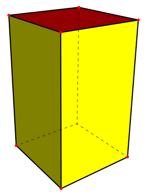

# Day 1

## Part 1

example.txt should output 58

The formula for calculating the slack is the product of the two smallest dimension: 

**smallest dimension** * **second smallest dimension**

## Part 2

example.txt should output 34

The ribbon needs to only wrap it around four sides, so use the smallest two dimensions:

**2x3x4**: **2 + 2 + 3 + 3** = **10**

then we need to make the bow which is just the product of all dimensions:

**2x3x4**: **2 * 3 * 4** = **24**

[Image source](https://commons.wikimedia.org/wiki/File:Square_prism.svg#/media/File:Square_prism.svg)